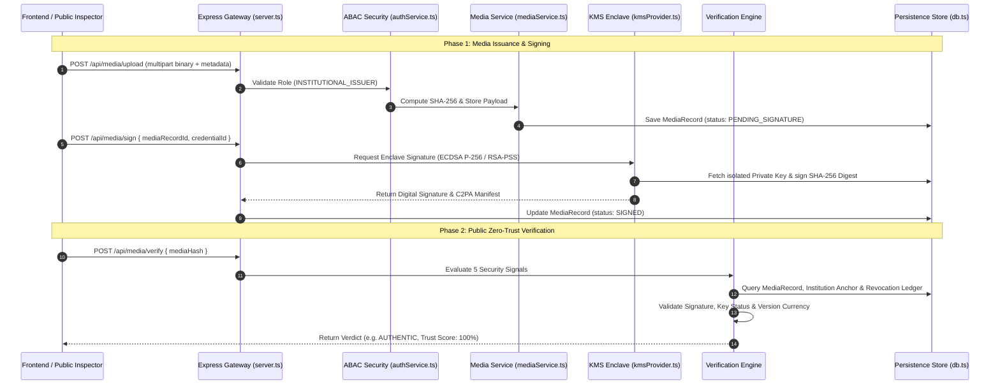
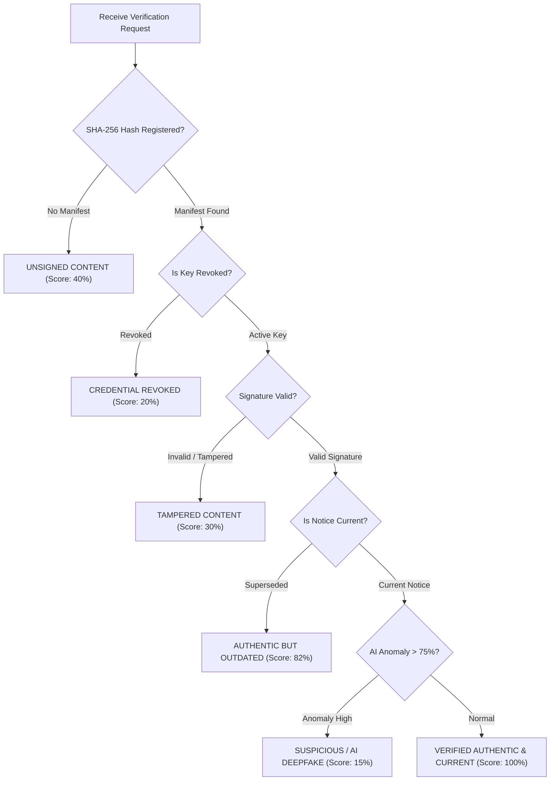

# TRUSTCOMM — Backend Technical Architecture & Systems Specification

> **SOAIDEATHON-S26 / Smart India Hackathon Research & Project Documentation**  
> *Focus Area: Cybersecurity, Digital Provenance, AI Safety, Cloud KMS & Cryptographic Verification*  
> *Backend Specification Version: 2.4.0*  
> *Document Date: August 2026*

---

## 📋 Table of Contents
1. [Executive Summary & System Overview](#1-executive-summary--system-overview)
2. [Backend Architecture & Cloud Functions Sequence Flow](#2-backend-architecture--cloud-functions-sequence-flow)
3. [Core Backend Security Modules & Specifications](#3-core-backend-security-modules--specifications)
   - [3.1 KMS Cryptographic Key Enclave (`kmsProvider.ts`)](#31-kms-cryptographic-key-enclave-kmsproviderts)
   - [3.2 Zero-Trust Verification Engine (`verificationService.ts`)](#32-zero-trust-verification-engine-verificationservicets)
   - [3.3 Institutional Identity & Key Revocation Manager (`credentialService.ts`)](#33-institutional-identity--key-revocation-manager-credentialservicets)
   - [3.4 Media Payload & Storage Engine (`mediaService.ts`)](#34-media-payload--storage-engine-mediaservicets)
   - [3.5 Persistence & Database Layer (`db.ts`)](#35-persistence--database-layer-dbts)
   - [3.6 ABAC Role Authentication (`authService.ts`)](#36-abac-role-authentication-authservicets)
   - [3.7 Modular AI & Blockchain Integration Hooks (`modularProviders.ts`)](#37-modular-ai--blockchain-integration-hooks-modularprovidersts)
4. [Cryptographic Specifications & Algorithms](#4-cryptographic-specifications--algorithms)
5. [Extended 6-Verdict Classification Pipeline](#5-extended-6-verdict-classification-pipeline)
6. [Complete REST API Contract Specification](#6-complete-rest-api-contract-specification)
7. [Threat Model & Security Controls Matrix](#7-threat-model--security-controls-matrix)
8. [SIH Demonstration & Test Flow Scenarios](#8-sih-demonstration--test-flow-scenarios)

---

## 1. Executive Summary & System Overview

The **TRUSTCOMM Backend** operates as the cryptographic anchor, media provenance processor, and institutional security authority for the TRUSTCOMM platform.

While post-distribution deepfake detectors rely on heuristics that struggle against novel generative models, **TRUSTCOMM** enforces **authenticity at the source**. The backend isolates institutional private signing keys within a hardware security enclave, generates SHA-256 content-bound digital signatures, tracks real-time key revocation status, and returns explainable trust verdicts to public recipients.

---

## 2. Backend Architecture & Cloud Functions Sequence Flow

---

## 3. Core Backend Security Modules & Specifications

### 3.1 KMS Cryptographic Key Enclave ([`kmsProvider.ts`](file:///c:/Users/Lenovo/OneDrive/Desktop/deepfake-proof-verification/deepfake-proof-verification/backend/src/cryptography/kmsProvider.ts))
* **Hardware Enclave Simulation**: Private keys are maintained strictly inside isolated memory and are never returned over API endpoints.
* **Supported Algorithms**:
  - `ECDSA_P256` (NIST curve `P-256` / `secp256r1` with SHA-256).
  - `RSA_PSS_SHA256` (RSA-PSS with 2048/4096-bit key modulus, MGF1 padding, and SHA-256 hashing).
* **Key Vault Operations**: Keypair creation, public key PEM export, digital signing over SHA-256 digests, and public signature validation.

### 3.2 Zero-Trust Verification Engine ([`verificationService.ts`](file:///c:/Users/Lenovo/OneDrive/Desktop/deepfake-proof-verification/deepfake-proof-verification/backend/src/verification/verificationService.ts))
* **5-Factor Multi-Signal Inspector**:
  1. **Content Digest Integrity**: Re-computes SHA-256 byte hash and checks against manifest assertions.
  2. **Cryptographic Signature Verification**: Validates ECDSA/RSA signature against authority's public key.
  3. **Real-Time Key Revocation Check**: Interrogates Revocation Ledger for key compromise events.
  4. **Notice Version Currency**: Flags out-of-date genuine announcements (`SUPERSEDED`).
  5. **AI Anomaly Secondary Risk Score**: Runs PyTorch spectral analysis to evaluate deepfake likelihood.

### 3.3 Institutional Identity & Key Revocation Manager ([`credentialService.ts`](file:///c:/Users/Lenovo/OneDrive/Desktop/deepfake-proof-verification/deepfake-proof-verification/backend/src/credentials/credentialService.ts))
* **Authority Registry**: Manages onboarding for verified government agencies (e.g. FEMA, WHO, NOAA, Disaster Management Authority).
* **Revocation Ledger**: Real-time revocation of compromised signing credentials with rationale logging.

### 3.4 Media Payload & Storage Engine ([`mediaService.ts`](file:///c:/Users/Lenovo/OneDrive/Desktop/deepfake-proof-verification/deepfake-proof-verification/backend/src/media/mediaService.ts))
* Handles multipart file uploads (audio, video, PDF, images).
* Generates SHA-256 content hashes and persists media binaries.

### 3.5 Persistence & Database Layer ([`db.ts`](file:///c:/Users/Lenovo/OneDrive/Desktop/deepfake-proof-verification/deepfake-proof-verification/backend/src/database/db.ts))
* In-memory JSON persistence layer with disk synchronization.
* Manages entities: `institutions`, `credentials`, `mediaRecords`, `verificationLogs`.

### 3.6 ABAC Role Authentication ([`authService.ts`](file:///c:/Users/Lenovo/OneDrive/Desktop/deepfake-proof-verification/deepfake-proof-verification/backend/src/auth/authService.ts))
* Enforces Attribute-Based Access Control rules across three roles: `SYSTEM_ADMIN`, `INSTITUTIONAL_ISSUER`, and `PUBLIC_RECIPIENT`.

### 3.7 Modular AI & Blockchain Integration Hooks ([`modularProviders.ts`](file:///c:/Users/Lenovo/OneDrive/Desktop/deepfake-proof-verification/deepfake-proof-verification/backend/src/verification/modularProviders.ts))
* **PyTorch Deepfake AI Detector Stub**: Interface for deep learning vision & speech models.
* **Polygon L2 Blockchain Stub**: Interface for immutable off-chain media hash anchoring.

---

## 4. Cryptographic Specifications & Algorithms

### SHA-256 Digesting
Media payload bytes $M$ are hashed using SHA-256:

$$H(M) = \text{SHA256}(M) \in \{0, 1\}^{256}$$

### Digital Signature Scheme
The backend KMS generates a digital signature $\sigma$ over $H(M)$ using the authority's private key $K_{\text{priv}}$:

$$\sigma = \text{Sign}_{K_{\text{priv}}}(H(M))$$

Verification asserts that:

$$\text{Verify}_{K_{\text{pub}}}(H(M), \sigma) \stackrel{?}{=} \text{TRUE}$$

### Composite Trust Score Formula
The backend calculates a unified percentage score $T \in [0, 100]$:

$$T = S_{\text{sig}} + S_{\text{auth}} + S_{\text{hash}} + S_{\text{rev}} + S_{\text{ver}} + S_{\text{ai}}$$

Where:
- $S_{\text{sig}} = 30$ pts if signature is cryptographically valid.
- $S_{\text{auth}} = 20$ pts if signed by a recognized certificate anchor.
- $S_{\text{hash}} = 20$ pts if computed SHA-256 matches manifest hash.
- $S_{\text{rev}} = 10$ pts if key is unrevoked (0 if revoked).
- $S_{\text{ver}} = 10$ pts if notice version is current (2 pts if superseded).
- $S_{\text{ai}} = \max(0, 10 - \lfloor \frac{\text{AI Anomaly \%}}{10} \rfloor)$ secondary penalty.

---

## 5. Extended 6-Verdict Classification Pipeline

---

## 6. Complete REST API Contract Specification

### Base Server URL: `http://localhost:3000`

| Method | Endpoint | Required Role | Summary Description |
| :--- | :--- | :--- | :--- |
| `GET` | `/api/health` | Public | System status, Cloud Functions & modular providers health |
| `GET` | `/api/institutions` | Public | List registered government & public institutions |
| `POST` | `/api/institutions` | `SYSTEM_ADMIN` | Register a new institutional authority |
| `GET` | `/api/credentials` | Public | List active and revoked credentials |
| `POST` | `/api/credentials` | `SYSTEM_ADMIN` | Issue a new KMS keypair for an institution |
| `POST` | `/api/credentials/revoke` | `SYSTEM_ADMIN` | Revoke a compromised credential immediately |
| `POST` | `/api/media/upload` | `INSTITUTIONAL_ISSUER` | Upload media payload binary & compute SHA-256 digest |
| `POST` | `/api/media/sign` | `INSTITUTIONAL_ISSUER` | Apply KMS digital signature to media digest |
| `POST` | `/api/media/verify` | Public | Zero-trust verification & trust score inspection |
| `GET` | `/api/media` | Public | Query registered media records |
| `GET` | `/api/storage/*` | Public | Retrieve media binary file from storage |
| `GET` | `/api/verification-logs` | Public | Query audit verification history |

---

## 7. Threat Model & Security Controls Matrix

| Threat Vector | Security Risk | Backend Security Control |
| :--- | :--- | :--- |
| **KMS Key Compromise** | Unauthorized notice generation | Real-Time Key Revocation Ledger + Hardware Enclave Isolation |
| **Payload Tampering** | Modified official broadcast | SHA-256 Content-Bound Digital Signatures |
| **Old Notice Replay** | Outdated panic advisory | Notice Versioning Registry (`SUPERSEDED` state detection) |
| **Fake Authority Impersonation** | Fake government agency | System Admin Institutional Onboarding & Certificate Anchors |
| **AI Synthetic Voice/Video** | Unsigned deepfake spread | Zero-Trust Verification Engine + PyTorch Secondary AI Inspector |
| **Unauthorized Signing Request** | Non-issuer uploading files | ABAC Header Validation (`x-user-role`, `x-institution-id`) |

---

## 8. SIH Demonstration & Test Flow Scenarios

The backend handles 6 standardized test cases mapping directly to Problem Statement S26 requirements:

1. **Scenario 1: Authentic Emergency Broadcast (v1)** $\rightarrow$ Returns `AUTHENTIC` (Trust Score: 100%).
2. **Scenario 2: Altered Video Payload** $\rightarrow$ Returns `TAMPERED` (SHA-256 mismatch detected).
3. **Scenario 3: Order Signed with Revoked Key** $\rightarrow$ Returns `REVOKED` (Blocked by Revocation Ledger).
4. **Scenario 4: Notice Version 1 Update Test** $\rightarrow$ Returns `SUPERSEDED` (Superseded by v2 notice).
5. **Scenario 5: Unsigned AI Voice Clone Press Audio** $\rightarrow$ Returns `SUSPICIOUS` (Neural TTS frequency cutoff).
6. **Scenario 6: Unverified Draft Policy** $\rightarrow$ Returns `UNSIGNED` (No manifest registered).
