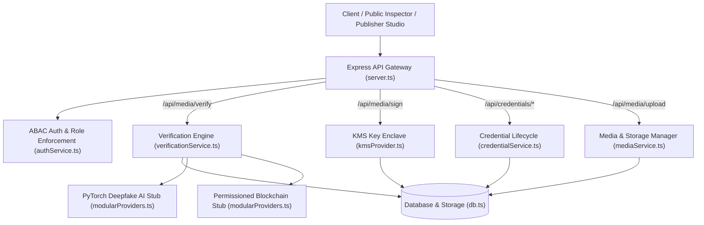

# ⚙️ TRUSTCOMM — Backend API & Cryptographic Service

> **Media Authenticity & Digital Provenance Verification Engine**  
> *Node.js / Express / TypeScript 5.8 / NodeCrypto & WebCrypto / KMS Enclave Enforcer*

---

## 🛡️ Overview

The **TRUSTCOMM Backend** serves as the core cryptographic authority, media provenance engine, and institutional management service for the TRUSTCOMM platform. It isolates institutional private keys inside a simulated Hardware Security Module (KMS Enclave), generates C2PA-compliant digital signatures over SHA-256 media digests, manages key revocation ledgers, and provides zero-trust public verification endpoints.

Designed with a modular **Serverless Cloud Functions** architecture, backend services run either as standalone cloud microservices or as an Express REST API server in local/production environments.

---

## 🌟 Architecture & Core Modules



---

## 🔑 Key Backend Modules

### 1. 🔐 KMS Key Enclave Enforcer ([`kmsProvider.ts`](file:///c:/Users/Lenovo/OneDrive/Desktop/deepfake-proof-verification/deepfake-proof-verification/backend/src/cryptography/kmsProvider.ts))
* **Hardware Security Module (HSM) Isolation**: Simulates Google Cloud KMS / AWS KMS hardware key vaults. Private keys are never exposed in API payloads or sent to clients.
* **Supported Algorithms**:
  - `RSA-PSS` (2048 / 4096-bit key size with SHA-256 hashing and MGF1 mask generation).
  - `ECDSA` (NIST Curve `P-256` / `secp256r1` with SHA-256).
* **Cryptographic Operations**:
  - Keypair generation & public key PEM export.
  - Generating digital signatures over raw SHA-256 media digests.
  - Validating digital signatures against public key anchors.

### 2. 📲 Public Verification Pipeline ([`verificationService.ts`](file:///c:/Users/Lenovo/OneDrive/Desktop/deepfake-proof-verification/deepfake-proof-verification/backend/src/verification/verificationService.ts))
* **Zero-Trust Inspector**: Evaluates content integrity without assuming caller trust.
* **Multi-Factor Security Analysis**:
  1. **Content Digest Verification**: Re-computes SHA-256 byte digest and compares against registered manifest claim.
  2. **Signature Validation**: Checks ECDSA/RSA signature against the issuing authority's public key.
  3. **Credential Revocation Check**: Queries real-time Revocation Ledger to detect compromised keys.
  4. **Version Currency Check**: Detects if an authentic notice has been superseded by a newer official release.
  5. **AI Deepfake Anomaly Detection**: Runs secondary multi-modal spectral & visual anomaly inspection.
* **Outputs 6 Extended Verdict States**: `AUTHENTIC`, `OUTDATED_SUPERSEDED`, `TAMPERED`, `REVOKED`, `SUSPICIOUS`, `UNSIGNED`.

### 3. 🏢 Institutional Identity & Credential Manager ([`credentialService.ts`](file:///c:/Users/Lenovo/OneDrive/Desktop/deepfake-proof-verification/deepfake-proof-verification/backend/src/credentials/credentialService.ts))
* **Institutional Onboarding**: Manages profiles for verified government agencies (e.g. FEMA, WHO, NOAA, Disaster Authorities).
* **Credential Lifecycle**: Issues, rotates, and revokes signing keypairs.
* **Real-Time Revocation Ledger**: Instant key invalidation with reason tracking (e.g., *HSM Perimeter Compromise*, *Key Expiry*).

### 4. 🗄️ Persistence & Storage Layer ([`db.ts`](file:///c:/Users/Lenovo/OneDrive/Desktop/deepfake-proof-verification/deepfake-proof-verification/backend/src/database/db.ts))
* In-memory DB driver with JSON backing file store for persistent local state.
* Stores records for `institutions`, `credentials`, `mediaRecords`, and `verificationLogs`.

### 5. 🛡️ Attribute-Based Access Control ([`authService.ts`](file:///c:/Users/Lenovo/OneDrive/Desktop/deepfake-proof-verification/deepfake-proof-verification/backend/src/auth/authService.ts))
* Validates incoming request headers (`x-user-role`, `x-institution-id`).
* Enforces role boundaries (`SYSTEM_ADMIN`, `INSTITUTIONAL_ISSUER`, `PUBLIC_RECIPIENT`).

---

## 📡 REST API Reference

### Base URL: `http://localhost:3000`

#### 1. System Health & Diagnostics
```http
GET /api/health
```
* **Access**: Public
* **Response (200 OK)**:
```json
{
  "status": "ok",
  "service": "Media Authenticity Verification Platform Backend",
  "timestamp": "2026-08-20T19:45:00.000Z",
  "cloudFunctions": ["uploadMedia", "signMedia", "verifyMedia", "revokeCredential"],
  "providers": {
    "kms": "NodeCryptoKMSProvider (Cloud KMS Ready)",
    "deepfakeAi": "CloudRunDeepfakeDetector (PyTorch Ready)",
    "blockchain": "BlockchainProvenanceStub (Polygon L2 Ready)"
  }
}
```

---

#### 2. Institutional Management
```http
GET /api/institutions
```
* **Access**: Public
* **Response (200 OK)**: List of registered institutional authorities.

```http
POST /api/institutions
```
* **Access**: `SYSTEM_ADMIN`
* **Headers**: `x-user-role: SYSTEM_ADMIN`
* **Body**:
```json
{
  "name": "Federal Emergency Management Agency (FEMA)",
  "domain": "fema.gov",
  "contactEmail": "alerts@fema.gov"
}
```

---

#### 3. Credential Lifecycle & Revocation
```http
GET /api/credentials?institutionId=inst-fema
```
* **Access**: Public

```http
POST /api/credentials
```
* **Access**: `SYSTEM_ADMIN`
* **Body**: `{ "institutionId": "inst-fema", "algorithm": "ECDSA_P256" }`

```http
POST /api/credentials/revoke
```
* **Access**: `SYSTEM_ADMIN`
* **Headers**: `x-user-role: SYSTEM_ADMIN`
* **Body**:
```json
{
  "credentialId": "cred-fema-primary",
  "revocationReason": "Compromised key vault perimeter (CVE-2026-0812)"
}
```

---

#### 4. Media Upload & KMS Signing
```http
POST /api/media/upload
```
* **Access**: `INSTITUTIONAL_ISSUER`
* **Headers**: `x-user-role: INSTITUTIONAL_ISSUER`, `x-institution-id: inst-fema`
* **Body (`multipart/form-data`)**: `file`, `institutionId`, `mediaType`, `title`, `noticeId`, `version`

```http
POST /api/media/sign
```
* **Access**: `INSTITUTIONAL_ISSUER`
* **Body**:
```json
{
  "mediaRecordId": "rec-1724032800000",
  "credentialId": "cred-fema-primary",
  "institutionId": "inst-fema"
}
```

---

#### 5. Public Zero-Trust Verification
```http
POST /api/media/verify
```
* **Access**: Public (`PUBLIC_RECIPIENT`)
* **Body**: `{ "mediaHash": "8f3b2075790c...9a0c" }` OR multipart file upload
* **Response (200 OK)**:
```json
{
  "verdict": "AUTHENTIC",
  "trustScore": 100,
  "mediaHash": "8f3b2075790c...9a0c",
  "isSigned": true,
  "tamperDetected": false,
  "issuerId": "inst-fema",
  "institutionName": "Federal Emergency Management Agency (FEMA)",
  "credentialStatus": "ACTIVE",
  "deepfakeScore": 0.02,
  "details": "Cryptographically verified official notice issued by Federal Emergency Management Agency (FEMA)."
}
```

---

#### 6. Audit & Storage Queries
```http
GET /api/media              # Query registered media records
GET /api/storage/:filename # Retrieve uploaded media binary
GET /api/verification-logs # Query off-chain audit logs
```

---

## 🗃️ Database Schemas

### `Institution`
```typescript
interface Institution {
  id: string;
  name: string;
  domain: string;
  status: 'ACTIVE' | 'SUSPENDED';
  createdAt: string;
  contactEmail: string;
}
```

### `KMSCredential`
```typescript
interface KMSCredential {
  id: string;
  institutionId: string;
  publicKeyPem: string;
  privateKeyPem?: string; // Strictly isolated in KMS Enclave
  algorithm: 'RSA_PSS_SHA256' | 'ECDSA_P256';
  status: 'ACTIVE' | 'REVOKED' | 'EXPIRED';
  issuedAt: string;
  revokedAt?: string;
  revocationReason?: string;
}
```

### `MediaRecord`
```typescript
interface MediaRecord {
  id: string;
  institutionId: string;
  credentialId: string;
  mediaHash: string; // SHA-256 hex string
  mediaType: 'AUDIO' | 'VIDEO' | 'NOTICE' | 'EMERGENCY';
  signature: string | null;
  status: 'PENDING_SIGNATURE' | 'SIGNED' | 'SUPERSEDED' | 'REVOKED';
  noticeId?: string;
  version?: string; // e.g. "v1.0", "v2.0"
  storagePath: string;
  createdAt: string;
}
```

---

## 🛠️ Development & Deployment

### Prerequisites
- Node.js `v18+` or Bun `v1.0+`
- TypeScript `5.8`

### Install Dependencies
```bash
cd backend
npm install
```

### Run Server in Development Mode
```bash
npm run dev
# Starts Express API server on http://localhost:3000
```

### Build Production Artifacts
```bash
npm run build
# Compiles backend to dist/server.cjs
```
