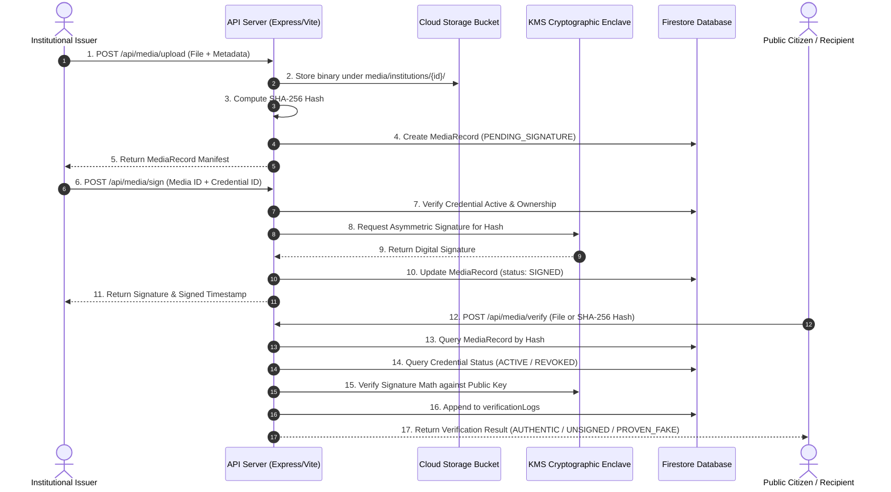

# Technical System Specification: SOA IDEATHON 2026 – Problem Statement S26

## 1. System Objective
The **TRUSTCOMM / AURA-TRUST** platform provides a deepfake-resistant provenance, digital signing, and authenticity verification infrastructure for government, defense, public health, meteorological, and municipal announcements.

---

## 2. Core Architectural Pillars

### 2.1 Cryptographic Source Binding (Primary Trust Anchor)
1. **Binary Payload Hashing**: Every official document, audio statement, or video briefing is deterministically hashed using SHA-256 (`256-bit`).
2. **Asymmetric Digital Signing**: The computed hash is signed using an active institutional credential issued under RSA-PSS (2048-bit) or ECDSA (NIST P-256 curve).
3. **Hardware Key Enclave / Cloud KMS**: Private keys are maintained exclusively inside secure backend enclaves (`kmsProvider.ts`) and never exposed to client applications or database storage.

### 2.2 Explainable Zero-Trust Verification Engine
The public verification engine evaluates communications against four deterministic checks:
1. **Record Existence Check**: Determines whether the SHA-256 hash was registered by an authorized issuing authority.
2. **Signature Validity Check**: Mathematically verifies the digital signature using the institution's public SPKI key.
3. **Revocation Registry Check**: Cross-references the signing key against the real-time Key Revocation Ledger.
4. **Secondary AI Anomaly Analysis**: Analyzes media frequency spectra and facial consistency metrics without overruling cryptographic proof.

### 2.3 Real-Time Key Revocation & Incident Response
- Immediate revocation of compromised credentials by System Administrators with mandatory incident reporting.
- Instantaneous nullification of all signatures generated by compromised credentials.

### 2.4 Privacy-Preserving Selective Disclosure (Zero-Knowledge Redaction)
- Salted cryptographic hash commitments (`SHA256(field:salt)`) enable selective field redaction (e.g. emergency responder GPS coordinates) while maintaining verifiable public auditability.

---

## 3. High-Level Data Flow

