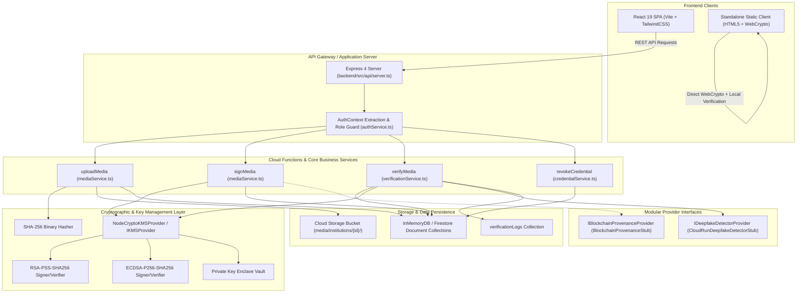
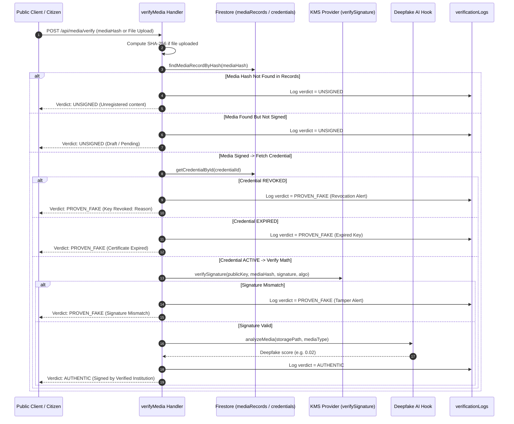

# Architecture State: SOA IDEATHON 2026 – Problem Statement S26

## 1. High-Level Architecture Overview

---

## 2. Core Verification & Signing Pipelines

### Pipeline 1: Media Upload (`uploadMedia`)
1. **Authentication & RBAC**: `AuthService.assertInstitutionalAccess(auth, targetInstitutionId)`.
2. **File Validation**: Validates MIME type against allowed list (`audio/*`, `video/*`, `application/pdf`, `text/*`).
3. **Binary Hashing**: Computes SHA-256 hash `H = SHA256(FileBytes)`.
4. **Storage Staging**: Stores file at `media/institutions/{institutionId}/{timestamp}-{safeFilename}`.
5. **Manifest Creation**: Stores document in `mediaRecords` collection:
   - `id`: Unique record identifier (`rec-...`)
   - `institutionId`: Foreign key to `institutions`
   - `credentialId`: Associated issuing key ID
   - `mediaHash`: SHA-256 digest
   - `mediaType`: `AUDIO` | `VIDEO` | `NOTICE` | `EMERGENCY`
   - `signature`: `null` (pending signature)
   - `status`: `PENDING_SIGNATURE`

### Pipeline 2: Cryptographic Signing (`signMedia`)
1. **Authority Verification**: Ensures caller is `INSTITUTIONAL_ISSUER` for the target institution.
2. **Credential Status Check**: Verifies credential exists, matches institution, and status is `ACTIVE`.
3. **Asymmetric Signing**: Calls `kmsProvider.signHash(credential.id, mediaHash, algorithm)` using backend private key.
4. **Manifest Finalization**: Updates `mediaRecords` with `signature`, `status: 'SIGNED'`, and `signedAt` timestamp.
5. **Provenance Receipt**: Returns signature string, media hash, algorithm, and timestamp.

### Pipeline 3: Zero-Trust Public Verification (`verifyMedia`)

### Pipeline 4: Credential Revocation (`revokeCredential`)
1. **Authorization**: `AuthService.assertSystemAdmin(auth)`.
2. **Validation**: Enforces non-empty `credentialId` and mandatory `revocationReason`.
3. **Revocation Execution**: Updates `credentials` document:
   - `status`: `'REVOKED'`
   - `revokedAt`: Current UTC ISO timestamp
   - `revocationReason`: Provided reason (e.g. key compromise, CVE audit, decommission)
4. **Immediate Nullification**: All future verification requests referencing this key immediately evaluate to `PROVEN_FAKE`.

---

## 3. Database Schema (Firestore Collections)

### Collection: `institutions/{institutionId}`
| Field | Type | Description |
| :--- | :--- | :--- |
| `id` | `string` | Unique institution ID (e.g. `inst-fema`, `inst-who`) |
| `name` | `string` | Official institutional name |
| `domain` | `string` | Verified public domain (e.g. `fema.gov`) |
| `status` | `'ACTIVE' \| 'PENDING' \| 'SUSPENDED'` | Operational status |
| `createdAt` | `string` (ISO 8601) | Registration timestamp |

### Collection: `credentials/{credentialId}`
| Field | Type | Description |
| :--- | :--- | :--- |
| `id` | `string` | Unique credential ID (e.g. `cred-fema-primary`) |
| `institutionId` | `string` | Reference to parent institution |
| `publicKey` | `string` (PEM) | SPKI public key for signature verification |
| `keyAlgorithm` | `'RSA-PSS-SHA256' \| 'ECDSA-P256-SHA256'` | Cryptographic algorithm |
| `status` | `'ACTIVE' \| 'REVOKED' \| 'EXPIRED'` | Key trust status |
| `revokedAt` | `string \| null` | Revocation timestamp if revoked |
| `revocationReason` | `string \| null` | Reason for revocation |
| `createdAt` | `string` (ISO 8601) | Key issuance timestamp |

### Collection: `mediaRecords/{recordId}`
| Field | Type | Description |
| :--- | :--- | :--- |
| `id` | `string` | Unique record ID (`rec-...`) |
| `institutionId` | `string` | Issuing institution ID |
| `credentialId` | `string` | Signing credential ID |
| `mediaHash` | `string` | 64-char hex SHA-256 digest |
| `mediaType` | `'AUDIO' \| 'VIDEO' \| 'NOTICE' \| 'EMERGENCY'` | Content category |
| `signature` | `string \| null` | Base64 digital signature |
| `storagePath` | `string` | Cloud Storage URI |
| `blockchainTxHash` | `string \| null` | Blockchain transaction hash |
| `status` | `'PENDING_SIGNATURE' \| 'SIGNED' \| 'REJECTED'` | Lifecycle status |
| `createdAt` | `string` (ISO 8601) | Upload timestamp |
| `signedAt` | `string \| null` | Signature timestamp |
| `originalFileName` | `string` | Uploaded filename |
| `fileSizeBytes` | `number` | File payload size |
| `mimeType` | `string` | Content MIME type |
| `title` | `string` | Public notice title |

### Collection: `verificationLogs/{logId}`
| Field | Type | Description |
| :--- | :--- | :--- |
| `id` | `string` | Unique log entry ID (`log-...`) |
| `mediaHash` | `string` | Checked SHA-256 hash |
| `verdict` | `'AUTHENTIC' \| 'UNSIGNED' \| 'PROVEN_FAKE'` | Final decision |
| `deepfakeScore` | `number \| null` | AI anomaly risk score |
| `isSigned` | `boolean` | Whether signature exists |
| `issuerId` | `string \| null` | Issuing institution ID |
| `tamperDetected` | `boolean` | Flag for hash/sig tampering |
| `checkedAt` | `string` (ISO 8601) | Verification timestamp |
| `details` | `string` | Human-readable explanation |
| `institutionName` | `string` (optional) | Institution display name |
| `credentialStatus`| `string` (optional) | Credential state at check |

---

## 4. Key Management & KMS Integration
- **Abstract Interface (`IKMSProvider`)**:
  - `signHash(credentialId, hashHex, algorithm)`: Generates cryptographic digital signature.
  - `verifySignature(publicKeyPem, hashHex, signatureBase64, algorithm)`: Verifies signature against public key.
  - `generateKeyPair(algorithm)`: Produces new keypair, exports SPKI public key PEM, and stores private key in hardware security module / backend enclave.
- **Node.js Crypto Provider (`NodeCryptoKMSProvider`)**:
  - Emulates Google Cloud KMS HSM operations using Node.js `crypto` with `RSA-PSS` (2048-bit, salt length 32) and `ECDSA` (curve `prime256v1`).
- **Production GCP KMS Ready**:
  - Pre-architected to bind to `projects/{project}/locations/{location}/keyRings/{ring}/cryptoKeys/{key}/cryptoKeyVersions/{version}:asymmetricSign`.
