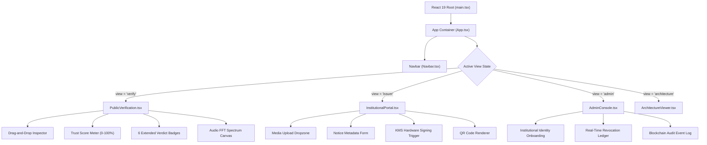

# TRUSTCOMM — Frontend Technical Architecture & Systems Specification

> **SOAIDEATHON-S26 / Smart India Hackathon Research & Project Documentation**  
> *Focus Area: Cybersecurity, Digital Provenance, AI Safety, Blockchain & Emergency Communication*  
> *Frontend Specification Version: 2.4.0*  
> *Document Date: August 2026*

---

## 📋 Table of Contents
1. [Executive Summary & System Overview](#1-executive-summary--system-overview)
2. [Frontend Architecture & Component Hierarchy](#2-frontend-architecture--component-hierarchy)
3. [User Experience Portals & Role Interfaces](#3-user-experience-portals--role-interfaces)
   - [3.1 Public Verification Inspector (`PublicVerification.tsx`)](#31-public-verification-inspector-publicverificationtsx)
   - [3.2 Institutional Issuance Studio (`InstitutionalPortal.tsx`)](#32-institutional-issuance-studio-institutionalportaltsx)
   - [3.3 System Admin Console (`AdminConsole.tsx`)](#33-system-admin-console-adminconsoletsx)
   - [3.4 System Architecture Inspector (`ArchitectureViewer.tsx`)](#34-system-architecture-inspector-architectureviewertsx)
   - [3.5 Global Navigation Bar (`Navbar.tsx`)](#35-global-navigation-bar-navbartsx)
4. [Client-Side Cryptography & Security Modules](#4-client-side-cryptography--security-modules)
   - [4.1 In-Browser WebCrypto Digesting](#41-in-browser-webcrypto-digesting)
   - [4.2 6 Extended Verdict Classification Pipeline](#42-6-extended-verdict-classification-pipeline)
   - [4.3 Explainable Trust Score Decision Engine](#43-explainable-trust-score-decision-engine)
   - [4.4 Soft-Binding Provenance Recovery Engine](#44-soft-binding-provenance-recovery-engine)
   - [4.5 Multi-Modal Forensic Canvas Visualizers](#45-multi-modal-forensic-canvas-visualizers)
5. [Standalone Zero-Dependency HTML5 Client (`frontend/standalone-client/`)](#5-standalone-zero-dependency-html5-client-frontendstandalone-client)
6. [API Integration & Data Flow Contracts](#6-api-integration--data-flow-contracts)
7. [UI/UX Design Tokens & Glassmorphism Theme](#7-uiux-design-tokens--glassmorphism-theme)
8. [Live Demonstration Scenarios (SIH Test Matrix)](#8-live-demonstration-scenarios-sih-test-matrix)

---

## 1. Executive Summary & System Overview

Generative AI has evolved digital document forgery into convincing synthetic audio, video, images, and official-looking announcements. Traditional deepfake detectors operate **post-distribution** and fail to verify who originally issued the content or whether signing credentials remain authorized.

The **TRUSTCOMM Frontend** addresses this challenge by establishing **authenticity at the source**. Built with React 19, TypeScript, and native WebCrypto browser APIs, the client application allows citizens, authorities, and security teams to verify digital media, issue cryptographically signed announcements, inspect C2PA provenance manifests, and track key revocation statuses in real-time.

---

## 2. Frontend Architecture & Component Hierarchy



---

## 3. User Experience Portals & Role Interfaces

### 3.1 Public Verification Inspector ([`PublicVerification.tsx`](file:///c:/Users/Lenovo/OneDrive/Desktop/deepfake-proof-verification/deepfake-proof-verification/frontend/src/components/PublicVerification.tsx))
* **Primary Persona**: Citizens, journalists, and public recipients of emergency notices.
* **Core Responsibilities**:
  - Drag-and-drop media file upload or URL verification link inspection.
  - Native client-side SHA-256 byte hashing using WebCrypto `window.crypto.subtle.digest`.
  - Rendering of explainable $0-100\%$ Trust Scores with individual breakdown bars.
  - Displaying one of **6 Extended Verdict States** (Verified, Superseded, Tampered, Revoked, Suspicious, Unsigned).
  - Real-time Web Audio API FFT spectral analysis for audio clips and canvas heatmaps for video.
  - Automatic resolution of perceptual soft-binding fingerprints for stripped media.

### 3.2 Institutional Issuance Studio ([`InstitutionalPortal.tsx`](file:///c:/Users/Lenovo/OneDrive/Desktop/deepfake-proof-verification/deepfake-proof-verification/frontend/src/components/InstitutionalPortal.tsx))
* **Primary Persona**: Verified institutional communications officers (e.g., FEMA, WHO, NOAA).
* **Core Responsibilities**:
  - Uploading official broadcasts, PDF notices, advisories, and press images.
  - Defining notice metadata: Title, Notice ID, Priority Level (`CRITICAL`, `HIGH`, `NORMAL`), Version (`v1.0`, `v2.0`), Geographic Scope, and Expiry Date.
  - Executing KMS hardware enclave digital signatures (ECDSA P-256 / RSA-PSS).
  - Rendering downloadable dynamic QR codes for physical/digital distribution.
  - Monitoring active institutional key vaults and signing credentials.

### 3.3 System Admin Console ([`AdminConsole.tsx`](file:///c:/Users/Lenovo/OneDrive/Desktop/deepfake-proof-verification/deepfake-proof-verification/frontend/src/components/AdminConsole.tsx))
* **Primary Persona**: Platform Security Administrators.
* **Core Responsibilities**:
  - Registering and onboarding verified government agencies and news organizations.
  - Revoking compromised signing keys instantly with revocation rationale logging.
  - Auditing off-chain permissioned blockchain transaction logs.

### 3.4 System Architecture Inspector ([`ArchitectureViewer.tsx`](file:///c:/Users/Lenovo/OneDrive/Desktop/deepfake-proof-verification/deepfake-proof-verification/frontend/src/components/ArchitectureViewer.tsx))
* **Primary Persona**: Security Auditors & Developers.
* **Core Responsibilities**:
  - Interactive visualization of serverless Cloud Functions (`uploadMedia`, `signMedia`, `verifyMedia`, `revokeCredential`).
  - Inspection of JSON-LD JUMBF C2PA 2.4 manifest claims.

### 3.5 Global Navigation Bar ([`Navbar.tsx`](file:///c:/Users/Lenovo/OneDrive/Desktop/deepfake-proof-verification/deepfake-proof-verification/frontend/src/components/Navbar.tsx))
* **Features**:
  - One-click role switching between Public Inspector, Issuer Studio, Admin Console, and Architecture Inspector.
  - Real-time Emergency Broadcast alert banner indicator.
  - Active network & API connection status indicator.

---

## 4. Client-Side Cryptography & Security Modules

### 4.1 In-Browser WebCrypto Digesting
To ensure content integrity without relying on server hash honesty, the client calculates the SHA-256 digest directly from the raw file `ArrayBuffer`:

```typescript
export async function calculateFileHash(file: File): Promise<string> {
  const buffer = await file.arrayBuffer();
  const hashBuffer = await window.crypto.subtle.digest('SHA-256', buffer);
  const hashArray = Array.from(new Uint8Array(hashBuffer));
  return hashArray.map(b => b.toString(16).padStart(2, '0')).join('');
}
```

### 4.2 6 Extended Verdict Classification Pipeline
The UI evaluates cryptographic, identity, credential, version, and AI signals to present a definitive verdict:

| Verdict Code | Badge Styling | Description |
| :--- | :--- | :--- |
| `VERIFIED_CURRENT` | 🟢 Emerald Glass | Cryptographically signed, unrevoked key, matching hash digest, current version. |
| `SUPERSEDED` | 🟡 Amber Glass | Genuinely signed, but superseded by a newer official notice version. |
| `TAMPERED` | 🔴 Rose Glass | Signature verification failed or media content bytes modified post-issuance. |
| `REVOKED` | 🔴 Rose Glass | Signed by a credential placed on the real-time Revocation Ledger. |
| `SUSPICIOUS` | 🔴 Rose Glass | Unsigned media exhibiting high AI deepfake anomaly risk ($>75\%$). |
| `UNSIGNED` | 🟡 Slate Glass | Content lacks C2PA manifest metadata. |

### 4.3 Explainable Trust Score Decision Engine
Calculates a weighted composite percentage score ($T \in [0, 100]$):

$$\text{Trust Score} = S_{\text{sig}} + S_{\text{auth}} + S_{\text{hash}} + S_{\text{rev}} + S_{\text{ver}} + S_{\text{ai}}$$

* $S_{\text{sig}} = 30$ pts if ECDSA signature is valid.
* $S_{\text{auth}} = 20$ pts if signed by a recognized certificate anchor.
* $S_{\text{hash}} = 20$ pts if computed SHA-256 matches manifest assertion.
* $S_{\text{rev}} = 10$ pts if key is active (0 if revoked).
* $S_{\text{ver}} = 10$ pts if version is current (2 pts if superseded).
* $S_{\text{ai}} = \max(0, 10 - \lfloor \frac{\text{AI Anomaly \%}}{10} \rfloor)$ secondary penalty.

### 4.4 Soft-Binding Provenance Recovery Engine
When social platforms strip metadata during upload, the frontend computes a perceptual fingerprint (`pfp_...`) from media features. If matched in the backend soft-binding registry, the UI displays a recovery notification: **"Soft-Binding Provenance Recovered"**.

### 4.5 Multi-Modal Forensic Canvas Visualizers
- **Audio FFT Analyzer**: Uses `AudioContext` and `AnalyserNode` to perform real-time frequency spectrum analysis, flagging artificial high-frequency cutoffs ($>16.2\text{kHz}$) typical of neural TTS text-to-speech models.
- **Video Heatmap Overlay**: Renders temporal face boundary anomaly heatmaps over HTML5 `<video>` elements.

---

## 5. Standalone Zero-Dependency HTML5 Client (`frontend/standalone-client/`)

The standalone client provides a self-contained browser implementation requiring zero build tools or `node_modules`:

```
frontend/standalone-client/
├── index.html        # Single-Page Application markup with glassmorphism layout
├── styles.css        # Pure CSS3 glassmorphism styling & animations
├── js/
│   ├── app.js        # Event handling & UI state management
│   ├── c2pa.js       # In-browser JSON-LD manifest parsing
│   ├── crypto.js     # Native WebCrypto ECDSA P-256 key generation & signing
│   ├── forensics.js  # Audio FFT spectral canvas rendering
│   ├── blockchain.js # Local simulated permissioned ledger
│   └── qr.js         # Client-side QR code generator
├── README.md         # Quickstart guide for standalone mode
└── DOCUMENTATION.md  # Technical architecture for standalone client
```

---

## 6. API Integration & Data Flow Contracts

The frontend communicates with the Express backend via REST endpoints proxied through Vite:

```typescript
// 1. Verify Media Payload
POST /api/verify
Request:  { mediaHash: string, manifestJson?: object, mediaUrl?: string }
Response: { verdict: VerdictState, trustScore: number, details: VerificationDetails }

// 2. Sign Media Payload
POST /api/sign
Request:  { mediaHash: string, metadata: NoticeMetadata, authorityId: string }
Response: { signature: string, manifest: C2PAManifest, qrCodeUrl: string }

// 3. Key Revocation Execution
POST /api/revocations
Request:  { keyId: string, authorityId: string, reason: string }
Response: { status: 'REVOKED', timestamp: string }

// 4. Onboard Institution
POST /api/institutions
Request:  { name: string, domain: string, publicKeyPem: string }
Response: { authorityId: string, status: 'ACTIVE' }
```

---

## 7. UI/UX Design Tokens & Glassmorphism Theme

The UI follows modern cyber-glassmorphism design guidelines:

```css
/* Core Theme Design Tokens */
--bg-dark: #090d16;
--card-glass-bg: rgba(15, 23, 42, 0.75);
--card-glass-border: rgba(255, 255, 255, 0.1);
--accent-cyan: #06b6d4;
--accent-emerald: #10b981;
--accent-rose: #f43f5e;
--accent-amber: #f59e0b;
--font-sans: 'Inter', system-ui, -apple-system, sans-serif;
```

---

## 8. Live Demonstration Scenarios (SIH Test Matrix)

The application includes 6 pre-loaded scenarios accessible directly from the **Public Verification Inspector**:

| Scenario # | Title | Expected Verdict | Trust Score | Key Indicator |
| :---: | :--- | :---: | :---: | :--- |
| **1** | Authentic Emergency Notice (v1) | 🟢 `VERIFIED_CURRENT` | `100%` | Valid ECDSA signature, unrevoked key, matching hash |
| **2** | Altered Video Payload | 🔴 `TAMPERED` | `30%` | Computed SHA-256 differs from manifest claim |
| **3** | Compromised Key Order | 🔴 `REVOKED` | `20%` | Key listed on real-time Revocation Ledger |
| **4** | Notice Version 1 Update Test | 🟡 `SUPERSEDED` | `82%` | Genuinely signed, but v2 has been published |
| **5** | AI Synthetic Audio Press Clip | 🔴 `SUSPICIOUS` | `15%` | Unsigned content with high FFT frequency cutoff anomaly |
| **6** | Unverified Policy Draft | 🟡 `UNSIGNED` | `40%` | Missing C2PA metadata manifest |
