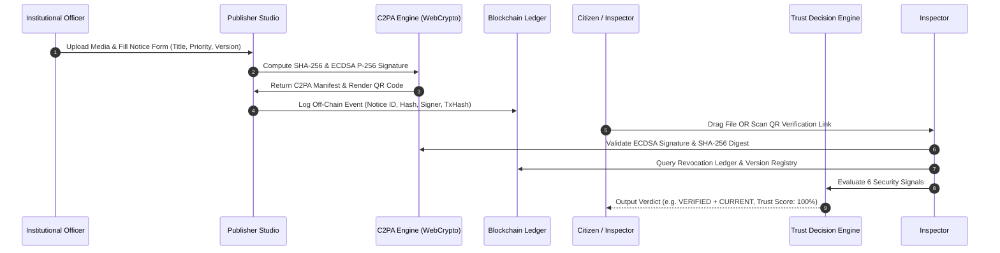

# TRUSTCOMM — Technical Architecture & Systems Specification

> **SOAIDEATHON-S26 / Smart India Hackathon Research & Project Documentation**  
> *Focus Area: Cybersecurity, Digital Provenance, AI Safety, Blockchain & Emergency Communication*  
> *Specification Version: 2.4.0*  
> *Document Date: August 2026*

---

## 📋 Table of Contents
1. [Executive Summary & Problem Statement](#1-executive-summary--problem-statement)
2. [Technical Position & System Framing](#2-technical-position--system-framing)
3. [System Architecture & Sequence Flow](#3-system-architecture--sequence-flow)
4. [Core Security Modules & Specifications](#4-core-security-modules--specifications)
   - [4.1 C2PA 2.4 Cryptographic Provenance Engine](#41-c2pa-24-cryptographic-provenance-engine)
   - [4.2 Tri-State & 6 Extended Verdict Classification](#42-tri-state--6-extended-verdict-classification)
   - [4.3 Explainable Trust Score Decision Engine](#43-explainable-trust-score-decision-engine)
   - [4.4 Notice Versioning & Superseded Detection](#44-notice-versioning--superseded-detection)
   - [4.5 Credential Lifecycle & Real-Time Key Revocation](#45-credential-lifecycle--real-time-key-revocation)
   - [4.6 Emergency Broadcast Mode & Geographic Scope](#46-emergency-broadcast-mode--geographic-scope)
   - [4.7 Soft-Binding Provenance Recovery](#47-soft-binding-provenance-recovery)
   - [4.8 Zero-Knowledge Privacy Redaction](#48-zero-knowledge-privacy-redaction)
   - [4.9 Permissioned Blockchain Audit Ledger](#49-permissioned-blockchain-audit-ledger)
   - [4.10 Multi-Modal AI Forensic Inspector](#410-multi-modal-ai-forensic-inspector)
5. [Threat Model & Security Controls Matrix](#5-threat-model--security-controls-matrix)
6. [Live Demonstration Scenarios (SIH Test Flow)](#6-live-demonstration-scenarios-sih-test-flow)
7. [Limitations & Technical Boundaries](#7-limitations--technical-boundaries)

---

## 1. Executive Summary & Problem Statement

### 1.1 Problem Statement
Generative AI has evolved digital document forgery into convincing synthetic audio, video, images, and official-looking announcements. A fabricated emergency notice or synthetic voice clone can spread across social media within minutes, triggering public panic, financial loss, and reputational damage.

Traditional deepfake detectors operate **post-distribution**. While a detector may estimate that a file looks synthetic, it cannot independently verify:
- Who originally issued the content
- Whether the claimed institution authorized it
- Whether the file is the latest official version
- Whether the signing credential has been revoked or compromised

### 1.2 The TRUSTCOMM Solution
**TRUSTCOMM** addresses this gap by establishing **authenticity at the source**. Official communications (audio, video broadcasts, PDFs, images) are cryptographically bound to verified institutional identities using **C2PA (Content Credentials)** standards. 

When citizens inspect content via the **TRUSTCOMM Citizen Portal** or scan a dynamic QR code, the system answers four fundamental questions:
1. **Who issued this?** (Verified institutional identity & officer role)
2. **Has it been altered?** (Tamper-evident SHA-256 content binding digest)
3. **Is the signer still authorized?** (Real-time Key Revocation Ledger)
4. **Is this the current official version?** (Automatic superseded notice detection)

---

## 2. Technical Position & System Framing

> [!IMPORTANT]
> **Core Technical Position (Section 15 Specification):**  
> TRUSTCOMM does not state *"Our AI detects every deepfake"* or *"Blockchain makes content authentic"*.  
> Instead, **cryptographic provenance is the primary authenticity layer**, while **AI-based manipulation analysis is a secondary risk signal**. TRUSTCOMM unifies provenance, institutional identity, credential status, version currency, and AI evidence into a single explainable verification decision.

---

## 3. System Architecture & Sequence Flow

---

## 4. Core Security Modules & Specifications

### 4.1 C2PA 2.4 Cryptographic Provenance Engine
- **Specification**: Implements C2PA 2.4 claims with JSON-LD JUMBF metadata manifest schema.
- **Cryptography**: Uses W3C Native WebCrypto API (`ECDSA` curve `P-256` with `SHA-256` hashing).
- **Hard Binding**: Binds media bytes directly to signed claim assertions (`c2pa.hash.data`).

### 4.2 Tri-State & 6 Extended Verdict Classification
The verification pipeline outputs one of six explicit states:

| Verdict State | Icon / Badge | Description |
| :--- | :--- | :--- |
| **VERIFIED AUTHENTIC & CURRENT** | 🟢 `AUTHENTIC_CURRENT` | Cryptographically signed, unrevoked key, matching digest, current notice version. |
| **AUTHENTIC BUT OUTDATED** | 🟡 `AUTHENTIC_OUTDATED` | Genuinely signed, but superseded by a newer official version (e.g., Version 2). |
| **TAMPERED CONTENT** | 🔴 `TAMPERED` | Signature failure, broken manifest claims, or media content digest mismatch. |
| **CREDENTIAL REVOKED** | 🔴 `REVOKED` | Signed by a key placed on the real-time Revocation Ledger due to HSM breach. |
| **SUSPICIOUS / AI DEEPFAKE** | 🔴 `SUSPICIOUS` | Unsigned content exhibiting high spectral/facial AI manipulation risk (>75%). |
| **UNSIGNED CONTENT** | 🟡 `UNSIGNED` | Lacks C2PA metadata manifest. |

### 4.3 Explainable Trust Score Decision Engine
Calculates a unified percentage score ($T \in [0, 100]$) evaluating 6 independent security factors:

$$\text{Trust Score} = S_{\text{sig}} + S_{\text{auth}} + S_{\text{hash}} + S_{\text{rev}} + S_{\text{ver}} + S_{\text{ai}}$$

Where:
- $S_{\text{sig}} = 30$ pts if ECDSA signature is cryptographically valid (0 otherwise).
- $S_{\text{auth}} = 20$ pts if signed by a trusted institutional certificate anchor (0 otherwise).
- $S_{\text{hash}} = 20$ pts if computed SHA-256 matches manifest digest (0 otherwise).
- $S_{\text{rev}} = 10$ pts if key is unrevoked (0 if revoked).
- $S_{\text{ver}} = 10$ pts if notice version is `CURRENT` (2 pts if `SUPERSEDED`).
- $S_{\text{ai}} = \max(0, 10 - \lfloor \frac{\text{AI Anomaly \%}}{10} \rfloor)$ pts secondary penalty.

### 4.4 Notice Versioning & Superseded Detection
Distinguishes genuine historical messages from active instructions. When an authority issues Version 2 of a notice, Version 1 is marked as `SUPERSEDED`. 
- Citizens inspecting Version 1 receive a warning: **"AUTHENTIC BUT OUTDATED (SUPERSEDED)"**, preventing old genuine announcements from causing public confusion.

### 4.5 Credential Lifecycle & Real-Time Key Revocation
When a private signing key or Hardware Security Module (HSM) is compromised:
- Security administrators issue a revocation record containing Key ID, Authority Name, Timestamp, and Reason.
- The verification inspector invalidates signatures tied to compromised credentials instantly.

### 4.6 Emergency Broadcast Mode & Geographic Scope
Allows authorized officers to specify:
- **Priority Level**: `CRITICAL`, `HIGH`, `NORMAL`
- **Geographic Scope**: e.g., `Coastal Sector 4 & Sector 5`
- **Validity Period**: `validFrom` and `validUntil` timestamps

### 4.7 Soft-Binding Provenance Recovery
When social media platforms re-encode media or strip EXIF/C2PA metadata:
- **TRUSTCOMM** computes a **Perceptual Fingerprint** (`pfp_...`) from invariant media features.
- If a match is found in the soft-binding registry, the system displays: **"Soft-Binding Provenance Recovered"**, linking the media back to its official origin.

### 4.8 Zero-Knowledge Privacy Redaction
To protect sensitive operational fields (e.g. responder GPS coordinates):
- Senders apply **Salted Hash Commitments**:
$$\text{Commitment} = \text{SHA256}(\text{FieldValue} \parallel \text{":"} \parallel \text{RandomSalt})$$
- Recipients verify commitment integrity without exposing raw text.

### 4.9 Permissioned Blockchain Audit Ledger
- Stores audit event logs off-chain to avoid privacy leakage.
- Logs immutable event blocks (`COMMUNICATION_SIGNED`, `VERSION_SUPERSEDED`, `CREDENTIAL_REVOKED`, `VERIFICATION_AUDIT`) with transaction hashes (`0x...`).

### 4.10 Multi-Modal AI Forensic Inspector
Acts as a secondary risk signal:
- **Audio**: Web Audio API FFT analyzer checks for artificial frequency truncation (>16.2kHz) and TTS phase artifacts.
- **Video**: Canvas thermal heatmap overlay detects temporal face boundary inconsistencies.
- **Document**: Scans OCR kerning and background noise uniformity for edited PDFs/images.

---

## 5. Threat Model & Security Controls Matrix

| Threat | Security Risk | TRUSTCOMM Security Control |
| :--- | :--- | :--- |
| **Stolen Signing Key** | Fake official notice | Real-time Credential Revocation Ledger + Role Separation |
| **Content Tampering** | Changed official message | Cryptographic SHA-256 Content Binding Digest |
| **Metadata Stripping** | Lost C2PA manifest | Perceptual Soft-Binding Fingerprint Recovery |
| **Fake Authority Impersonation** | Impersonation | Trusted Certificate Anchor & Key ID Registry |
| **Old Genuine Notice Reuse** | Public confusion | Version Currency & Expiry Date Verification |
| **AI Deepfake Impersonation** | Misinformation | No-Provenance Warning + Secondary AI Forensic Layer |
| **Credential Replay** | Continued abuse | Timestamp Validation + Revocation Evidence |
| **Privacy Leakage** | Sensitive data exposure | Zero-Knowledge Salted Hash Commitments + Off-Chain Media |

---

## 6. Live Demonstration Scenarios (SIH Test Flow)

The application includes 6 pre-configured test scenarios mapping directly to Section 12 (Steps 19–26) of the research report:

1. **Scenario 1: Authentic Emergency Broadcast (Version 1)**  
   *Result*: `VERIFIED AUTHENTIC & CURRENT` (Trust Score: 100%)
2. **Scenario 2: Altered Video Payload**  
   *Result*: `TAMPERED CONTENT` (SHA-256 digest mismatch)
3. **Scenario 3: Order Signed with Compromised Key**  
   *Result*: `CREDENTIAL REVOKED` (Blocked by Revocation Ledger)
4. **Scenario 4: Notice Version 1 Update Test**  
   *Result*: `AUTHENTIC BUT OUTDATED (SUPERSEDED)` (Superseded by v2)
5. **Scenario 5: Unsigned AI Voice Clone Press Audio**  
   *Result*: `SUSPICIOUS / AI DEEPFAKE` (Neural TTS cutoff detected)
6. **Scenario 6: Unverified Policy Draft Notice**  
   *Result*: `UNSIGNED CONTENT` (Missing manifest alert)

---

## 7. Limitations & Technical Boundaries

1. **AI Anomaly Detection**: AI detectors provide secondary risk signals and may produce false positives or false negatives. Cryptographic provenance remains primary.
2. **Factual Truth**: Cryptographic provenance proves who signed content and whether it was altered; it does not guarantee the underlying factual statement is true.
3. **Compromised Workflow**: An authorized signer operating under coercion can still produce a valid signature until the credential is explicitly revoked.
