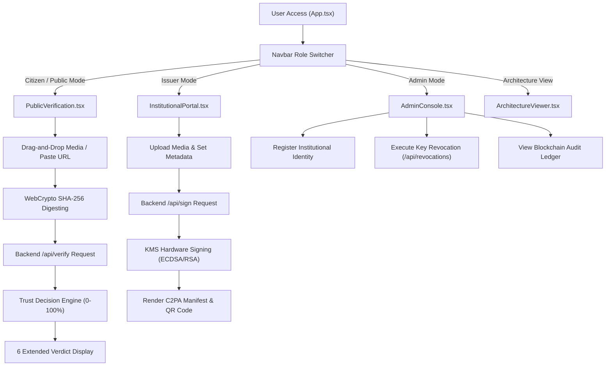

# 🎨 TRUSTCOMM — Frontend UI & User Experience Layer

> **Media Authenticity & Provenance Verification Platform — Client Application**  
> *React 19 / TypeScript 5.8 / Vite 6 / Tailwind CSS v4 / WebCrypto API*

---

## 🛡️ Overview

The **TRUSTCOMM Frontend** is a modern, high-tech glassmorphism web application designed to combat AI deepfakes and fake news by establishing **authenticity at the source**. 

It provides tailored interfaces for three core operational personas:
1. **Citizens & Public Recipients**: Drag-and-drop media inspector to verify authenticity, validate SHA-256 content digests, scan QR codes, and review explainable AI deepfake risk scores.
2. **Institutional Issuers (Government/Media Officers)**: Official publishing studio to upload notices, execute KMS cryptographic signatures, attach C2PA metadata, and issue verified communications.
3. **Security Administrators**: Institutional onboarding console to register official authorities, manage credential lifecycles, and execute real-time key revocations.

Additionally, the frontend includes a zero-dependency **Standalone HTML5/ES6 Client** (`frontend/standalone-client/`) for offline browser verification.

---

## 🌟 Key Components & Modules

### 1. 🔍 Public Verification Inspector ([`PublicVerification.tsx`](file:///c:/Users/Lenovo/OneDrive/Desktop/deepfake-proof-verification/deepfake-proof-verification/frontend/src/components/PublicVerification.tsx))
* **Local In-Browser SHA-256 Digesting**: Calculates content hashes locally using native `window.crypto.subtle.digest('SHA-256')` before server communication.
* **Explainable Trust Decision Engine**: Visualizes composite $0-100\%$ trust scores with breakdown meters for ECDSA signature validity, institutional anchor, hash match, key revocation state, version currency, and AI anomaly detection.
* **6 Extended Verdict Outcomes**:
  - 🟢 `VERIFIED AUTHENTIC & CURRENT` — Cryptographically signed, unrevoked key, content hash matches, notice version up to date.
  - 🟡 `AUTHENTIC BUT OUTDATED (SUPERSEDED)` — Valid signature, but superseded by a newer official notice version.
  - 🔴 `TAMPERED CONTENT` — Broken signature or media content bytes modified post-issuance.
  - 🔴 `CREDENTIAL REVOKED` — Signed using a key marked as compromised on the real-time Revocation Ledger.
  - 🔴 `SUSPICIOUS / AI DEEPFAKE` — Unsigned media exhibiting high neural audio/visual anomaly scores ($>75\%$).
  - 🟡 `UNSIGNED CONTENT` — Media lacking a C2PA metadata manifest.
* **Multi-Modal Forensic Overlay**: Interactive Web Audio FFT frequency visualizer and video thermal heatmap canvas.
* **Perceptual Soft-Binding Recovery**: Recovers provenance for media stripped of EXIF/C2PA metadata by social platforms.

### 2. ✍️ Institutional Issuance Studio ([`InstitutionalPortal.tsx`](file:///c:/Users/Lenovo/OneDrive/Desktop/deepfake-proof-verification/deepfake-proof-verification/frontend/src/components/InstitutionalPortal.tsx))
* **Official Media Upload**: Drag-and-drop support for emergency broadcasts, video advisories, audio press releases, and PDF notices.
* **Notice Metadata Builder**: Sets notice title, version (e.g. `v1.0`, `v2.0`), priority (`CRITICAL`, `HIGH`, `NORMAL`), valid timeframes, and geographic target scope.
* **KMS Signature Trigger**: Calls backend KMS hardware enclave simulation to generate ECDSA P-256 / RSA-PSS digital signatures.
* **Dynamic QR Code Generator**: Generates shareable QR codes containing embedded verification links.
* **Key Vault Monitor**: Displays active institutional signing credentials and algorithm details.

### 3. 🔐 System Admin Console ([`AdminConsole.tsx`](file:///c:/Users/Lenovo/OneDrive/Desktop/deepfake-proof-verification/deepfake-proof-verification/frontend/src/components/AdminConsole.tsx))
* **Institutional Onboarding**: Registers verified government agencies (e.g., FEMA, WHO, NOAA, Disaster Management Authority).
* **Real-Time Key Revocation Ledger**: Revokes compromised signing credentials instantly with documented reason tracking (e.g., *HSM Key Compromise*, *Officer Rotation*).
* **Blockchain Audit Log Viewer**: Displays off-chain audit logs (`COMMUNICATION_SIGNED`, `KEY_REVOKED`, `VERIFICATION_AUDIT`).

### 4. 📐 Architecture Visualizer ([`ArchitectureViewer.tsx`](file:///c:/Users/Lenovo/OneDrive/Desktop/deepfake-proof-verification/deepfake-proof-verification/frontend/src/components/ArchitectureViewer.tsx))
* **Cloud Functions Visualizer**: Interactive diagram showing `uploadMedia`, `signMedia`, `verifyMedia`, and `revokeCredential` workflows.
* **C2PA Manifest Inspector**: Explores sample JSON-LD JUMBF manifest structures and assertions.

### 5. 🌐 Standalone HTML5 Client ([`frontend/standalone-client/`](file:///c:/Users/Lenovo/OneDrive/Desktop/deepfake-proof-verification/deepfake-proof-verification/frontend/standalone-client/))
* **Zero-Dependency Web App**: Pure vanilla HTML5/ES6 modules running client-side WebCrypto cryptography and Web Audio FFT without `npm` build requirements.

---

## 📐 User Interface & State Architecture



---

## 🛠️ Technology Stack

| Layer | Technology | Description / Usage |
| :--- | :--- | :--- |
| **Framework** | React 19 + TypeScript 5.8 | Modern component hierarchy with strict interface typing |
| **Build Tool** | Vite 6 | ESM bundling, fast HMR dev server, optimized production builds |
| **Styling** | Tailwind CSS v4 | Dark glassmorphism, responsive cyber aesthetic |
| **Icons** | Lucide React | Modern vector icon set |
| **Cryptography** | WebCrypto API (`crypto.subtle`) | Browser-native SHA-256 hashing and key verification |
| **Audio Forensics** | Web Audio API | Real-time FFT frequency spectrum & cutoff analysis |

---

## 📁 Component Directory Structure

```
frontend/
├── src/
│   ├── components/
│   │   ├── AdminConsole.tsx         # System Admin portal (Institutions & Revocation)
│   │   ├── ArchitectureViewer.tsx   # System Architecture & Cloud Functions inspector
│   │   ├── InstitutionalPortal.tsx  # Official Media Upload & KMS Signing Studio
│   │   ├── Navbar.tsx               # Navigation bar with role switcher & status badges
│   │   └── PublicVerification.tsx   # Public media inspector & trust score visualizer
│   ├── App.tsx                      # Main SPA root container & global active view state
│   ├── index.css                    # Tailwind CSS imports, custom scrollbars & glass styling
│   ├── main.tsx                     # React 19 DOM mounting entry point
│   └── types.ts                     # Shared TypeScript data models & interfaces
├── standalone-client/               # Zero-dependency vanilla HTML5/ES6 demonstration
│   ├── index.html                   # Single-page standalone layout
│   ├── styles.css                   # Standalone CSS glassmorphism theme
│   ├── DOCUMENTATION.md             # Standalone client architecture spec
│   ├── README.md                    # Standalone client quickstart
│   └── js/                          # Modular ES6 scripts (c2pa, crypto, forensics, etc.)
├── DOCUMENTATION.md                 # Complete system technical specification
├── index.html                       # Vite HTML template
├── vite.config.ts                   # Vite configuration & dev server proxies
├── package.json                     # Frontend dependencies & scripts
└── README.md                        # Frontend overview & quickstart guide
```

---

## 🚀 Development & Setup

### Prerequisites
- Node.js `v18+` or Bun `v1.0+`
- Express Backend running on port `3000` (or started concurrently)

### 1. Install Dependencies
```bash
cd frontend
npm install
```

### 2. Run Development Server
```bash
npm run dev
# Starts Vite dev server at http://localhost:5173 (proxied to backend at http://localhost:3000)
```

### 3. Build for Production
```bash
npm run build
# Compiles production bundle to frontend/dist/
```

---

## 🧪 Testing Scenarios & Demo Flow

The frontend features 6 pre-configured live test scenarios accessible directly from the **Public Verification Inspector**:

1. **Authentic Emergency Notice (v1)** — Returns `VERIFIED AUTHENTIC & CURRENT` (100% Trust Score).
2. **Altered Video Payload** — Returns `TAMPERED CONTENT` (SHA-256 digest mismatch).
3. **Compromised Key Order** — Returns `CREDENTIAL REVOKED` (Blocked by Revocation Ledger).
4. **Superseded Notice Test** — Returns `AUTHENTIC BUT OUTDATED (SUPERSEDED)` (v1 superseded by v2).
5. **AI Synthetic Audio** — Returns `SUSPICIOUS / AI DEEPFAKE` (Neural FFT cutoff detected).
6. **Unsigned Policy Draft** — Returns `UNSIGNED CONTENT` (Lacks C2PA metadata).
